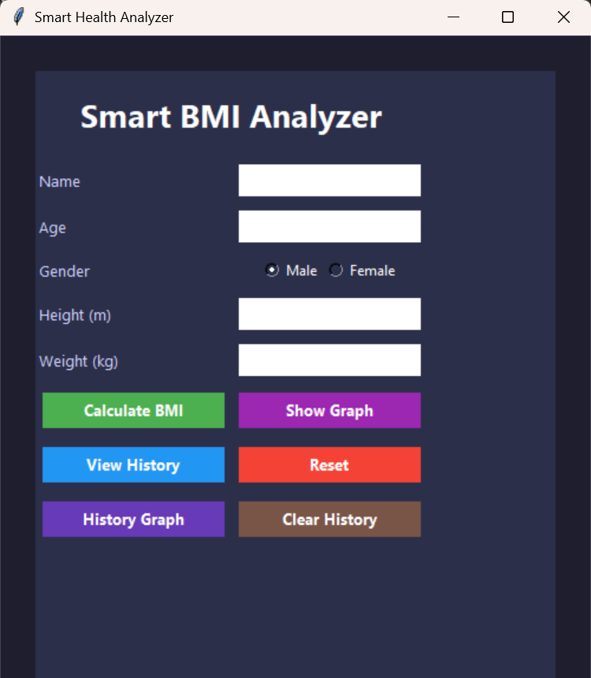
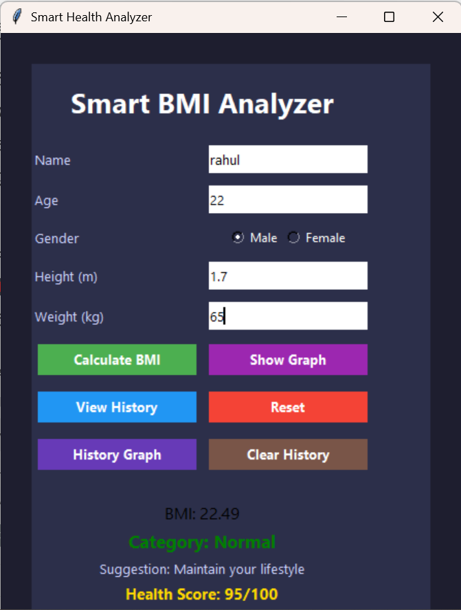
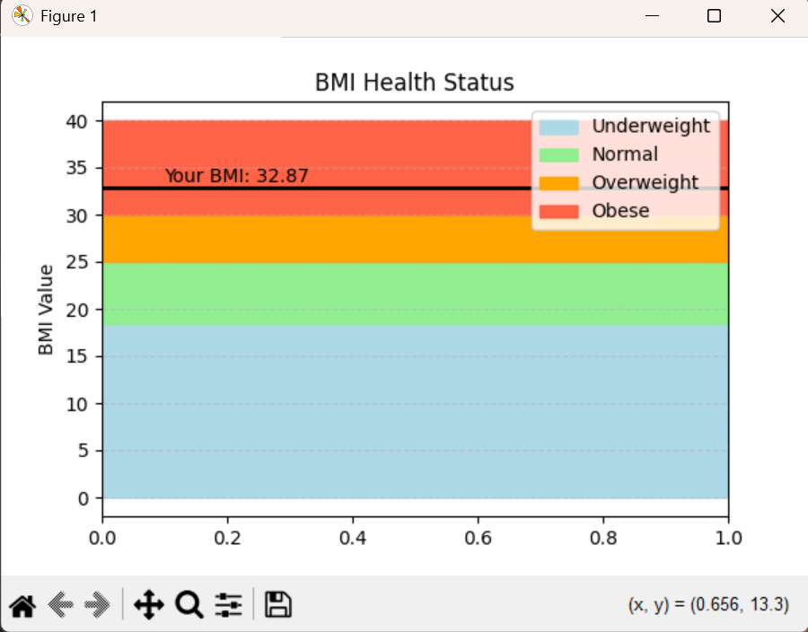
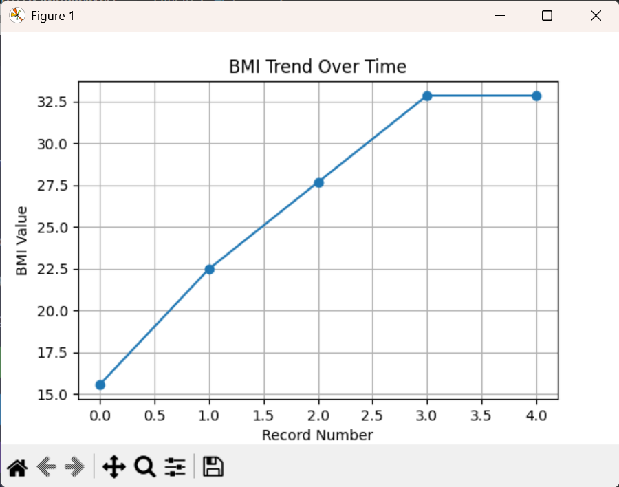

# 🧠 Smart BMI Analyzer

A **Python-based Smart Health Analyzer** that calculates BMI, provides health insights, stores user data, and visualizes trends using graphs.

---

## 🚀 Features

* BMI Calculation
* Category Detection (Underweight, Normal, Overweight, Obese)
* Health Suggestions
* Health Score System
* History Storage using CSV
* View User History
* BMI Graph Visualization
* BMI Trend Graph (History Analysis)
* Modern GUI using Tkinter

---

## 🛠 Technologies Used

* Python
* Tkinter
* Matplotlib
* CSV

---

## 📸 Screenshots

### 🖥 Main UI



### 📊 BMI Result



### 📉 BMI Graph



### 📈 History Graph



---

## ▶️ How to Run

1. Install Python
2. Install matplotlib:

```
pip install matplotlib
```

3. Run the project:

```
python bmi.py
```

---

## 📂 Project Structure

```
OIBSIP/
 ├── bmi.py
 ├── bmi_data.csv
 └── Screenshots/
```

---

## 📊 How It Works

* User enters details (name, age, height, weight)
* BMI is calculated using:

```
BMI = weight / (height^2)
```

* Based on BMI:

  * Category is identified
  * Health suggestion is given
  * Health score is calculated
* Data is stored in a CSV file
* Graphs are generated for:

  * Current BMI analysis
  * BMI trend over time

---

## 🎯 Conclusion

This project demonstrates:

* GUI development
* File handling
* Data visualization
* Real-world application design


