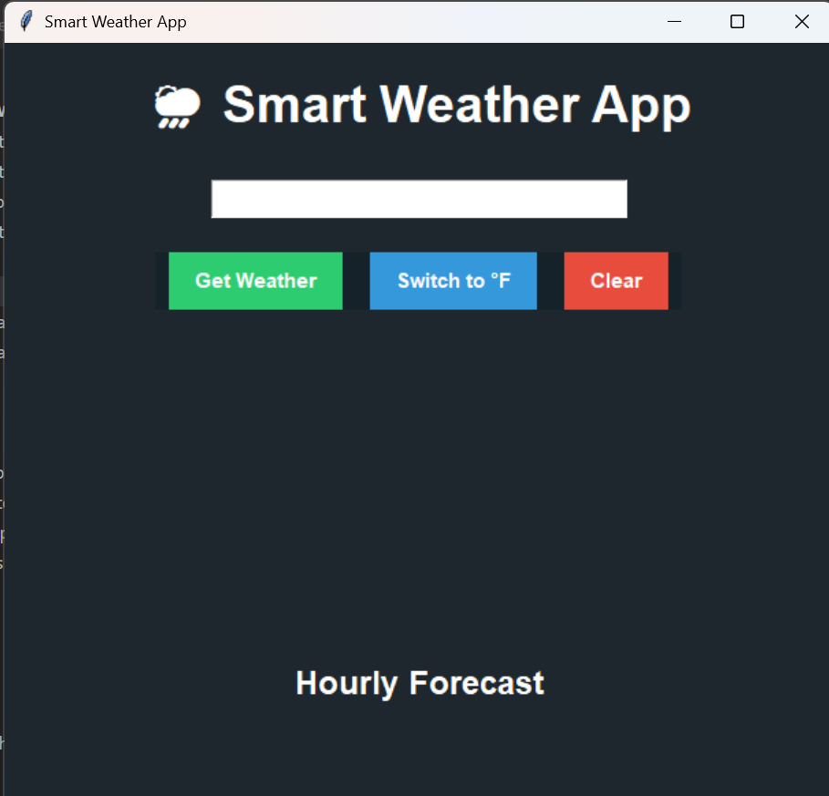
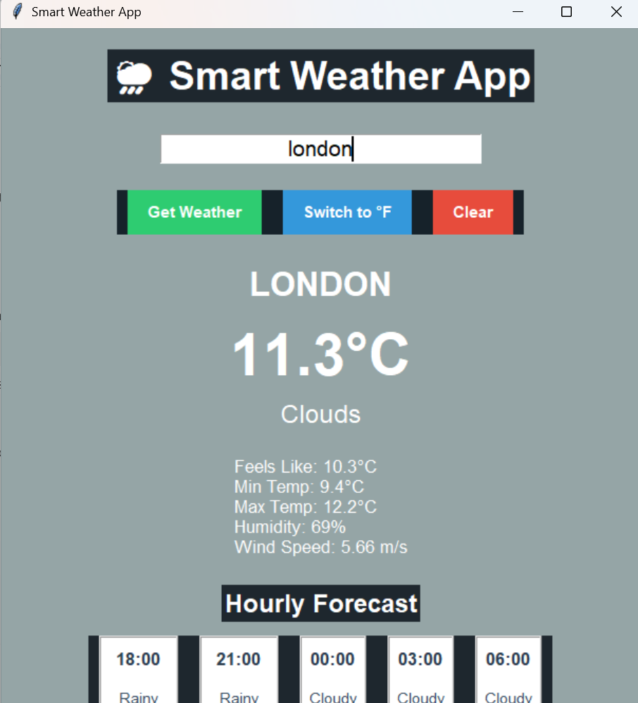
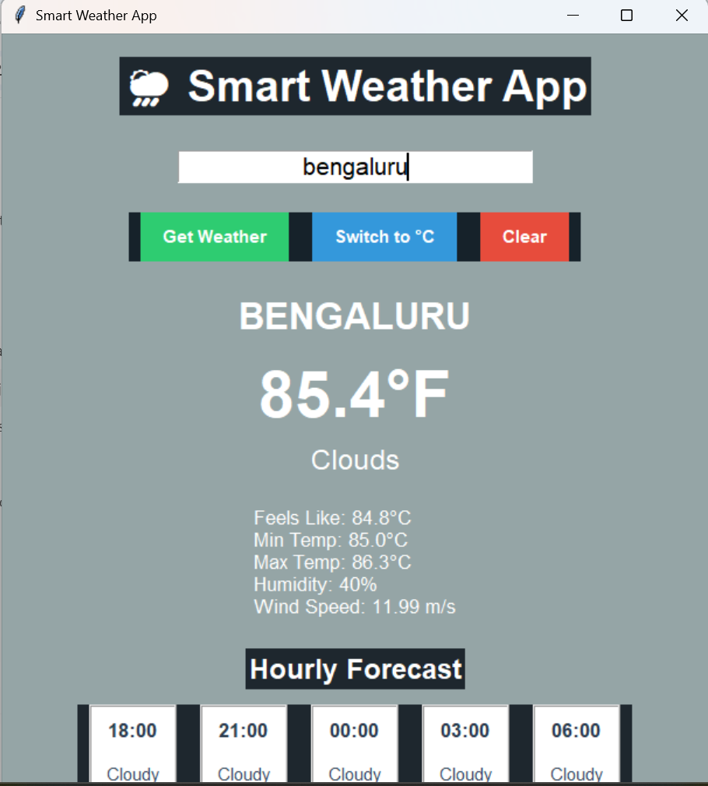
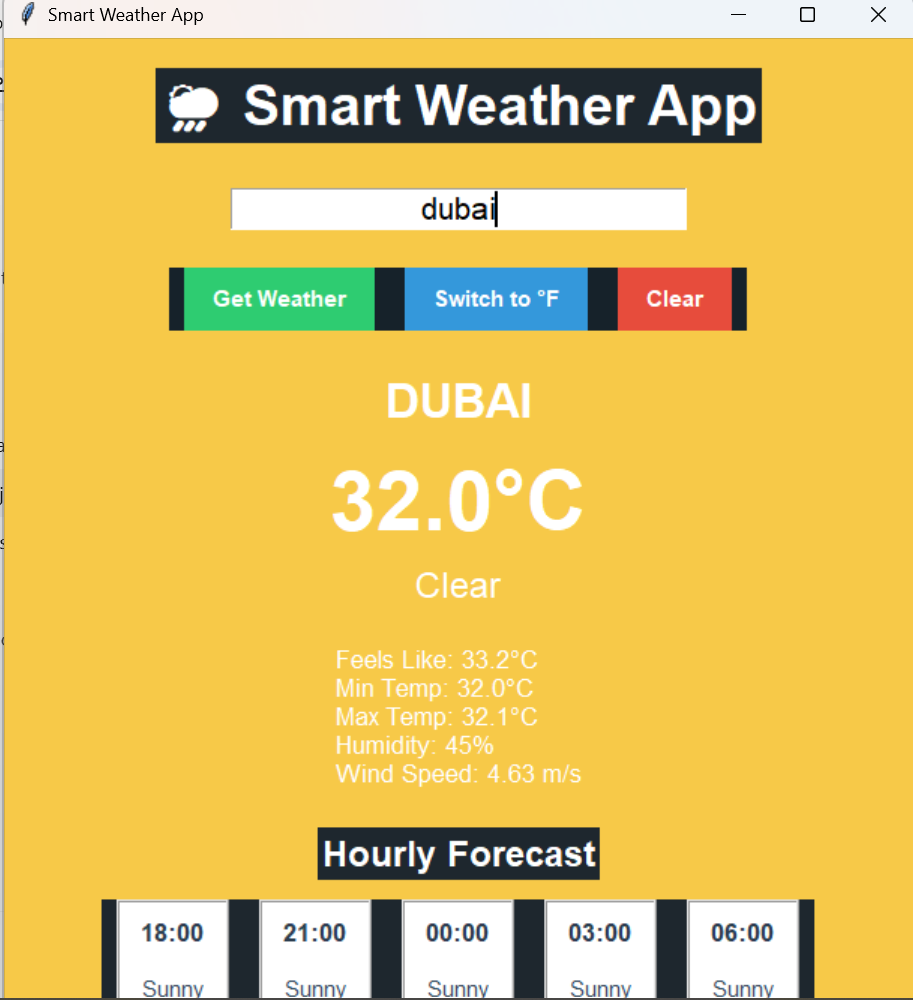

# 🌦️ Smart Weather App

A modern Python-based Weather Application developed using **Tkinter** and **OpenWeatherMap API**.  
This application provides real-time weather updates, hourly forecasts, daily forecasts, dynamic weather themes, and temperature conversion with an attractive GUI interface.

---

# 🚀 Features

- 🌍 Real-Time Weather Information
- 🌡️ Temperature in Celsius & Fahrenheit
- ⏰ Hourly Weather Forecast
- 🎨 Dynamic Background Themes Based on Weather
- ☁️ Weather Condition Icons
- 💨 Wind Speed Display
- 💧 Humidity Information
- 🌆 Modern GUI using Tkinter
- 🔄 Temperature Unit Conversion
- 📍 City-Based Weather Search

---

# 🛠️ Technologies Used

- Python
- Tkinter
- OpenWeatherMap API
- Requests Library

---

# 📸 Screenshots

## 🌤️ Main Weather Interface



---

## ⏰ Hourly Forecast



---

## 🌡️ Fahrenheit Mode



---

## 🎨 Dynamic Weather Theme



---

# ⚙️ Installation

1. Clone the repository

```bash
git clone https://github.com/your-username/OIBSIP.git
```

2. Open Weather_App folder

```bash
cd Weather_App
```

3. Install required library

```bash
pip install requests
```

4. Run the project

```bash
python weather_app.py
```

---

# 🔑 API Used

This project uses the **OpenWeatherMap API** for fetching weather data.

🌐 https://openweathermap.org/api
